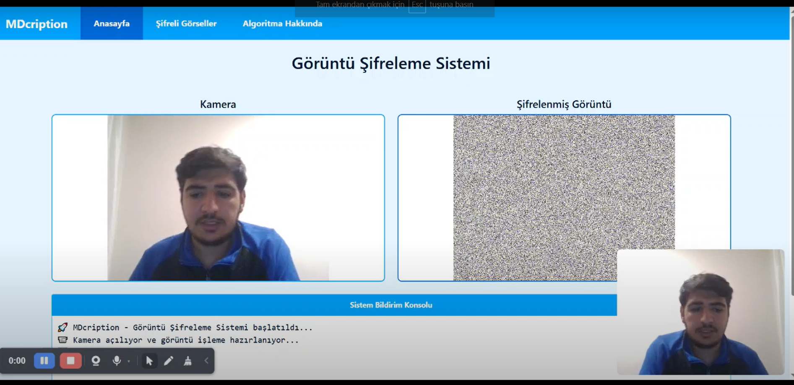
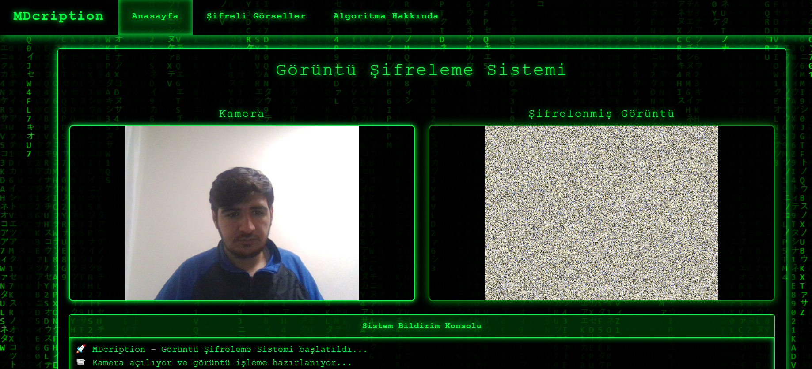

# ImageCription - Görüntü Şifreleme Sistemi


<p align="center">
  
</p>

## 📹 Tanıtım Videoları

Bu projenin tanıtım ve kurulum videolarını izlemek için aşağıdaki bağlantılara tıklayabilirsiniz:

<table>
  <tr>
    <td align="center" width="50%">
      <a href="https://youtu.be/sONvWO89beE?si=yCHHiuO5Yb2MRAk-" title="Güncel Versiyon Tanıtım Videosu">
        
        <br>
        <b>▶️ Güncel versiyon tanıtım videosunu izlemek için tıklayınız!</b>
      </a>
    </td>
    <td align="center" width="50%">
      <a href="https://youtu.be/sONvWO89beE?si=yCHHiuO5Yb2MRAk-" title="Eski Versiyon Tanıtım Videosu">
        
        <br>
        <b>▶️ Eski versiyon tanıtım videosunu izlemek için tıklayınız!</b>
      </a>
    </td>
  </tr>
</table>

## 📑 İçindekiler

- [Proje Hakkında](#-proje-hakkında)
- [Özellikler](#-özellikler)
- [Sistem Gereksinimleri](#-sistem-gereksinimleri)
- [Kurulum](#-kurulum)
- [Kullanım](#-kullanım)
- [Algoritma Detayları](#-algoritma-detayları)
- [Güvenlik Analizi](#-güvenlik-analizi)
- [Katkıda Bulunma](#-katkıda-bulunma)
- [İletişim](#-i̇letişim)
- [Lisans](#-lisans)

## 🔒 Proje Hakkında

ImageCription, görüntü dosyalarını güvenli bir şekilde şifrelemek ve deşifrelemek için geliştirilmiş modern bir görüntü güvenlik sistemidir. İki aşamalı şifreleme algoritması (Piksel Karıştırma + XOR) ile güçlü bir koruma sağlar ve web tabanlı arayüzü sayesinde kullanımı oldukça kolaydır.

Bu proje, kişisel görüntülerin güvenliğini sağlamak, hassas tıbbi görüntüleri korumak veya dijital içerik telif haklarını korumak için idealdır. Sistem, güvenli bir şekilde görüntüleri şifreler, deşifreler ve yönetir.

## ✨ Özellikler

- **İki Aşamalı Şifreleme**: 
  - Piksel Karıştırma (Pixel Shuffle): Görüntü piksellerini rastgele karıştırma
  - XOR Şifreleme: Bit düzeyinde XOR işlemi ile şifreleme

- **Kullanıcı Dostu Arayüz**:
  - Sürükle-bırak dosya yükleme
  - Web kamerası ile canlı şifreleme
  - Şifrelenmiş görüntü galerisi

- **Güvenlik Özellikleri**:
  - Kişiselleştirilmiş şifreleme anahtarı
  - Dijital imza (gizli watermark) özelliği
  - Veritabanı ile şifreleme indeksi güvenliği

- **Sistem Özellikleri**:
  - Flask tabanlı web uygulaması
  - SQLite veritabanı entegrasyonu
  - OpenCV ile gelişmiş görüntü işleme

## 💻 Sistem Gereksinimleri

- Python 3.8 veya üzeri
- Tarayıcı: Chrome, Firefox, Edge (son sürümler)
- İnternet bağlantısı (yerel kurulum için)
- Web kamerası (canlı şifreleme özelliği için)

## 🚀 Kurulum

### 1. Repoyu Klonlayın

```bash
git clone https://github.com/mehmetdogandev/imagecription.git
cd imagecription
```

### 2. Sanal Ortam Oluşturun ve Aktive Edin

#### Windows:
```bash
python -m venv env
env\Scripts\activate
```

#### macOS / Linux:
```bash
python -m venv env
source env/bin/activate
```

### 3. Gerekli Kütüphaneleri Yükleyin

```bash
pip install -r requirements.txt
```

### 4. Uygulamayı Başlatın

```bash
python app.py
```

### 5. Web Tarayıcınızda Açın

```
http://127.0.0.1:5000
```

## 📱 Kullanım

### Görüntü Şifreleme

1. Ana sayfaya gidin (`http://127.0.0.1:5000`)
2. "Görüntü Seç" butonuna tıklayın veya bir görüntüyü alana sürükleyip bırakın
3. "Şifrele" butonuna tıklayın
4. Şifrelenen görüntü ve orijinal görüntü yan yana gösterilecektir
5. "Kaydet" butonuna tıklayarak şifrelenmiş görüntüyü